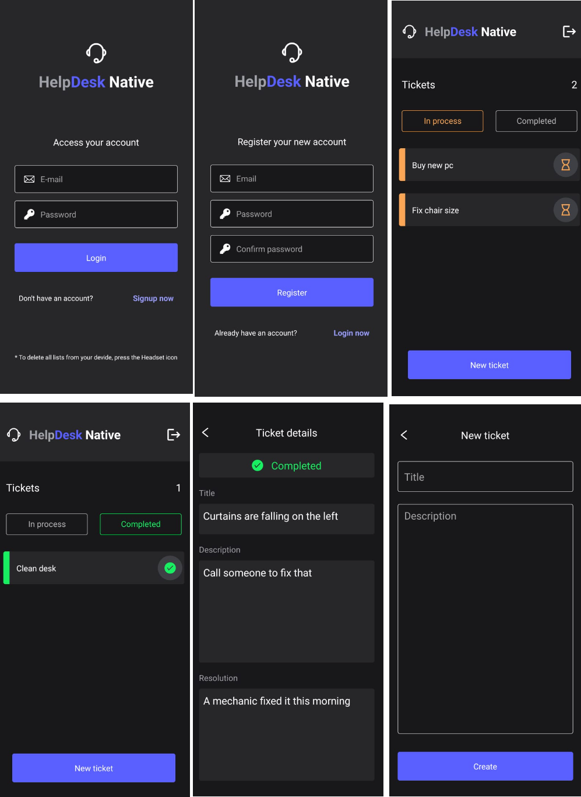

# React Native Ticket manager

## React Native - Expo
  
## Português:

Um app de controle the chamados, pode ser usado em uma empresa para abrir chamados para a área de TI ou Facilities.
Possui lógica de registro e login de usuário e fetch the lista de chamados de acordo com o usuário logado

Link para download do APK do projeto, pode ser instalado direto em aparelho Android:
https://expo.dev/artifacts/eas/mYxVZqvvpEWm8oEVpegBAi.apk

## English:

A ticket control app that can be used in a company to open tickets for the IT or Facilities departments.
It includes user registration and login logic and fetches the list of tickets according to the logged-in user.

Download link for the APK of the project, which can be installed directly on Android devices:
https://expo.dev/artifacts/eas/mYxVZqvvpEWm8oEVpegBAi.apk

